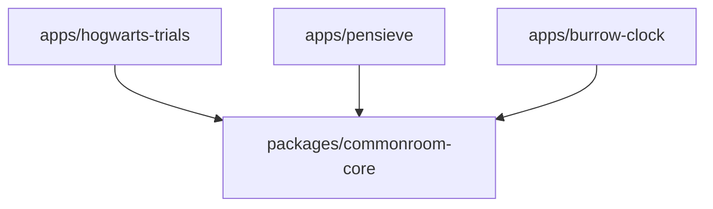

# Commonroom Architecture Specification

## 1. Monorepo Rationale & Structure

**Commonroom** uses a monorepo structure to house multiple independent products alongside shared core contracts. 

### Why a Monorepo?
- **Unified Domain Contracts**: Shared data contracts (e.g., identity, house affiliation, privacy primitives) evolve synchronously without cross-repo dependency drift.
- **Independent Deployability**: Each application maintains distinct build and deployment pipelines; apps are decoupled runtime artifacts.
- **Consistent Governance**: Shared linting, agent guidelines, security invariants, and content standards apply across the entire ecosystem.

```text
commonroom/
├── apps/
│   ├── hogwarts-trials/       # Academic trivia & house competition
│   ├── pensieve/              # AI companion & canonical lore discovery
│   └── burrow-clock/          # Consensual family/friend presence sharing
├── packages/
│   └── commonroom-core/       # Shared contracts, domain types, and interfaces
├── docs/                      # Ecosystem specifications and standards
│   ├── architecture.md
│   ├── product-vision.md
│   └── ip-and-content-boundaries.md
├── AGENTS.md                  # Instructions for AI coding agents
├── README.md                  # Project overview and ecosystem guide
└── .gitignore
```

---

## 2. Conceptual Dependency Rules

The dependency graph in Commonroom is strictly unidirectional and strictly stratified.



### Dependency Invariants
1. **`apps/* -> packages/commonroom-core`**: Applications may import contracts, interfaces, and utilities published by `commonroom-core`.
2. **No Direct Inter-App Dependencies**: Applications must **never** depend on or import from each other's internal modules or private state:
   - ❌ `apps/hogwarts-trials` must **never** import from `apps/pensieve` or `apps/burrow-clock`
   - ❌ `apps/pensieve` must **never** import from `apps/hogwarts-trials` or `apps/burrow-clock`
   - ❌ `apps/burrow-clock` must **never** import from `apps/hogwarts-trials` or `apps/pensieve`
3. **Cross-Product Interaction**: Any future communication between apps must occur strictly via public APIs, shared event streams, or standardized contracts defined in `packages/commonroom-core`.

---

## 3. Product Domain Boundaries

| Feature / Domain Responsibility | Hogwarts Trials | Pensieve | The Burrow Clock | `commonroom-core` |
| :--- | :---: | :---: | :---: | :---: |
| Quiz Engine & Question Banks | **OWNS** | ❌ | ❌ | ❌ |
| Quiz Scoring & Academic Exams (O.W.L./N.E.W.T.) | **OWNS** | ❌ | ❌ | ❌ |
| Sorting Ceremony & Quiz House Points | **OWNS** | ❌ | ❌ | ❌ |
| AI Assistant Experience & Chat | ❌ | **OWNS** | ❌ | ❌ |
| News Aggregation & Summarization | ❌ | **OWNS** | ❌ | ❌ |
| Lore Retrieval with Canonical Citations | ❌ | **OWNS** | ❌ | ❌ |
| Specialist Knowledge Modules (Potions, Spells) | ❌ | **OWNS** | ❌ | ❌ |
| Location Sharing & Geofences | ❌ | ❌ | **OWNS** | ❌ |
| Presence States & Ambient Family Clocks | ❌ | ❌ | **OWNS** | ❌ |
| Granular Friend Sharing Permissions | ❌ | ❌ | **OWNS** | ❌ |
| Shared Identity & Profile Contracts | Reads/Consumes | Reads/Consumes | Reads/Consumes | **OWNS (Contract)** |
| Shared House Enum / Profile Schemas | Reads/Consumes | Reads/Consumes | Reads/Consumes | **OWNS (Contract)** |
| Cross-App Privacy & Consent Primitives | Reads/Consumes | Reads/Consumes | Reads/Consumes | **OWNS (Contract)** |

### Specific Boundaries

#### Hogwarts Trials
- **Owns**: Quizzes, question bank curation, quiz evaluation/scoring, adaptive difficulty, sorting ceremony, academic knowledge progression, house points earned via quiz activity, competitive quiz leaderboards, and formal examinations.
- **Does Not Own**: Live news aggregation, general-purpose conversational LLM assistants, or friend location tracking.

#### Pensieve
- **Owns**: AI companion interactions, canonical lore search and question answering, source-provenance attribution, wizarding world news ingestion and summarization, structured learning modules (spells, potions, creatures), and explicitly declared generative roleplay.
- **Does Not Own**: Authoritative competitive quiz scoring/grading or friend GPS tracking.

#### The Burrow Clock
- **Owns**: Consensual friend/family relationships required for location sharing, geofencing, presence state computation, per-friend permission scoping, location-sharing sessions, group clock UI, and optional map views.
- **Does Not Own**: Wizarding lore retrieval, trivia question authoring, or AI-generated lore reasoning.

---

## 4. Shared Package Philosophy (`packages/commonroom-core`)

`packages/commonroom-core` is reserved exclusively for primitives and contracts shared across two or more applications. It is **not** a general utility dumping ground.

### Criteria for Inclusion in Core:
1. **Multi-Consumer Requirement**: A concept must be actively required by at least two distinct applications.
2. **Contract Stability**: Types and interfaces must represent stable domain boundaries (e.g., User ID, House identifier, generic permission state).
3. **No App-Specific Business Logic**: Scoring algorithms, LLM prompting chains, and geofence math belong in their respective apps, not in core.

### Planned Shared Concepts (Documented Only — Not Implemented in Foundation Phase):
- **User Identity Contracts**: Global user identifiers, account metadata interfaces.
- **Wizarding Profile**: House affiliation, wand attributes, patronus representations.
- **Friendship Contracts**: Shared relational graphs for cross-product interactions.
- **Shared Achievement Contracts**: Cross-ecosystem badges and milestones.
- **Notification Contracts**: Event structures for dispatching ecosystem alerts.
- **Privacy & Permission Primitives**: Baseline consent models, scoping flags, and access tokens.

---

## 5. Privacy Architecture & Invariants (The Burrow Clock)

The Burrow Clock operates under strict architectural privacy invariants:

1. **Default-Off**: Location sharing is disabled by default and requires active, explicit user opt-in.
2. **Explicit Consent**: Every sharing relationship and session requires explicit, recorded user consent.
3. **Instant Revocability**: A user can revoke sharing permissions globally or per-friend at any time with immediate effect.
4. **Per-Friend Scoping**: Permissions are configurable on a granular per-friend basis (e.g., Friend A sees *Approximate/State*, Friend B sees *Geofenced Presence*, Friend C sees *Nothing*).
5. **Resolution Control**: The system distinguishes between approximate presence (e.g., *In London*, *At Home*) and precise coordinate data. Raw coordinates must never be broadcast by default.
6. **Session Expiry**: Temporary sharing sessions must support automated time-based expiration.
7. **Persistent Visibility**: The UI must maintain an unambiguous, persistent indicator whenever active location sharing is in progress.
8. **Relationship Termination Invariant**: Removing, blocking, or un-friending a contact must immediately and permanently revoke all location access for that contact.
9. **Ephemeral Retention**: Historical coordinate traces must not be retained indefinitely; presence is ephemeral by design.
10. **Safety Delineation**: Fantasy status indicators (e.g., *"Mortal Peril"*, *"Lost in the Forbidden Forest"*) are purely playful roleplay states and must **never** be algorithmically inferred from real-world GPS anomalies.
11. **Emergency Independence**: Any future actual emergency/SOS functionality must be completely decoupled from roleplay and fantasy UI presentation.

---

## 6. Canon & Content Architecture

To maintain trust and accuracy across the ecosystem, all content systems must classify information into explicit tiers:

```text
[Content Ingestion / Generation]
        │
        ├── 1. Book Canon (Primary canonical literature)
        ├── 2. Film / Adaptation Material (Cinematic differences & additions)
        ├── 3. Officially Published Expanded Material (Authorized companion guides)
        ├── 4. Current Factual News (Real-world franchise releases & events)
        ├── 5. Fan Interpretation & Inference (Community analysis & theory)
        └── 6. Generated Roleplay (LLM-synthesized interactive narratives)
```

### Content Invariants
- **Provenance Requirement**: Canonical answers in Pensieve and validated questions in Hogwarts Trials must carry source citations (work, chapter/scene, or official publication).
- **No Silent Hallucination**: AI-generated responses must never masquerade as verified canonical facts. Generative roleplay or speculative extrapolation must be clearly labeled.
- **Deterministic Quiz Grounding**: Competitive quiz grading in Hogwarts Trials must rely on verified, curated question banks with provenance rather than unvalidated live LLM generation.

---

## 7. Technology Architecture & Decisions

The formal technology architecture for Commonroom has been established through Architecture Decision Records:
- **Consolidated Architecture**: See [docs/technology-architecture.md](technology-architecture.md) for full stack specifications, data strategies, API paradigms, and deployment models.
- **Architecture Decision Records**: See [docs/adr/](adr/README.md) for individual decision records covering client platforms, backend services, datastores/retrieval, and workspace tooling.
