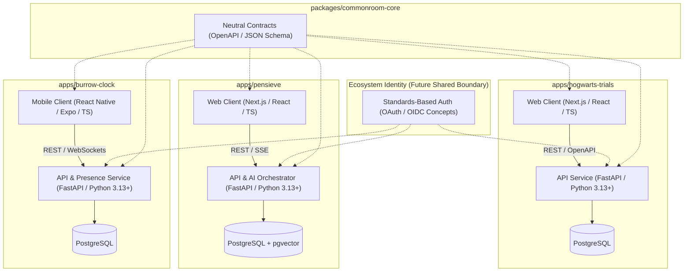

# Commonroom Technology Architecture

This document defines the consolidated production technology architecture for the **Commonroom** ecosystem, establishing the approved platform standards, data tiers, API contracts, and engineering boundaries across all products.

For specific architectural rationales and alternative analyses, see the linked [Architecture Decision Records (ADRs)](adr/README.md).

---

## 1. Architectural Goals

1. **Independent Product Deployability**: Each application (Hogwarts Trials, Pensieve, The Burrow Clock) operates with independent release cycles, decoupled runtime processes, and dedicated product datastores/schemas.
2. **Type Safety Across Boundaries**: Strict end-to-end typing from database models and API schemas to frontend client components without manual cross-language duplication.
3. **Ecosystem Suitability**: Align frontend stacks with modern React/TypeScript paradigms and backend stacks with Python's rich data, AI, and asynchronous web ecosystem.
4. **Minimal Operational Overhead**: Maintain architectural simplicity and zero vendor lock-in during foundational stages by utilizing a unified database technology (PostgreSQL + pgvector) and standard workspace tooling (pnpm, uv).
5. **Rigid Privacy and Safety Enforcement**: Preserve privacy invariants in The Burrow Clock and provenance integrity in Pensieve through server-enforced authorization and strict credential boundaries.

---

## 2. Technology Decision Matrix

| Dimension | Hogwarts Trials | Pensieve | The Burrow Clock | `commonroom-core` |
| :--- | :--- | :--- | :--- | :--- |
| **Client Platform** | Web-First (Desktop/Mobile) | Web-First (Desktop/Mobile) | Mobile-First (iOS/Android) | N/A |
| **Client Tech Stack** | TypeScript, React, Next.js | TypeScript, React, Next.js | TypeScript, React Native, Expo | N/A |
| **Backend Runtime** | Python 3.13+ | Python 3.13+ | Python 3.13+ | N/A |
| **Backend Framework** | FastAPI + Pydantic | FastAPI + Pydantic | FastAPI + Pydantic | N/A |
| **Primary API Paradigm** | REST + OpenAPI | REST + OpenAPI | REST + OpenAPI | Neutral Schema Contracts |
| **Realtime Mechanisms** | None (Polling where needed) | Server-Sent Events (SSE) | WebSockets | Event Schema Contracts |
| **Primary Datastore** | PostgreSQL | PostgreSQL | PostgreSQL | Domain Data Types |
| **Semantic Retrieval** | N/A | PostgreSQL + `pgvector` | N/A | N/A |
| **Workspace Tooling** | `pnpm` (Web), `uv` (API) | `pnpm` (Web), `uv` (API) | `pnpm` (Mobile), `uv` (API) | `pnpm` / `uv` / Schemas |

---

## 3. High-Level Ecosystem Architecture Diagram



```text
                         Commonroom Identity
                                │
              ┌─────────────────┼─────────────────┐
              │                 │                 │
       Hogwarts Trials       Pensieve       The Burrow Clock
       Next.js / TS          Next.js / TS    RN + Expo / TS
              │                 │                 │
          FastAPI            FastAPI            FastAPI
              │                 │                 │
         PostgreSQL      PostgreSQL+pgvector   PostgreSQL
```

---

## 4. Per-Product Architecture Specifications

### 4.1 Hogwarts Trials
- **Client**: Web-first Next.js application built with React and TypeScript. Focuses on interactive quiz progression, sorting ceremony experiences, exam timers, and responsive house dashboards.
- **Backend**: FastAPI service handling deterministic exam grading, question bank management, anti-tamper scoring verification, and house point transactions.
- **Datastore**: PostgreSQL storing structured question banks, user exam records, house points, and difficulty progression curves.
- **ADR References**: [ADR 0001](adr/0001-client-platforms.md), [ADR 0002](adr/0002-backend-and-api.md), [ADR 0003](adr/0003-data-and-retrieval.md).

### 4.2 Pensieve
- **Client**: Web-first Next.js application built with React and TypeScript. Optimized for rich lore exploration, reading wizarding news digests, and streaming conversational AI interactions with source provenance.
- **Backend**: FastAPI service orchestrating AI model interactions, document ingestion, canonical citation retrieval, and token streaming via Server-Sent Events (SSE).
- **Datastore & Retrieval**: PostgreSQL with the `pgvector` extension for co-located storage of relational article metadata and dense vector embeddings.
- **ADR References**: [ADR 0001](adr/0001-client-platforms.md), [ADR 0002](adr/0002-backend-and-api.md), [ADR 0003](adr/0003-data-and-retrieval.md).

### 4.3 The Burrow Clock
- **Client**: Mobile-first application built with React Native and Expo (TypeScript). Integrates with native mobile OS background location APIs, geofences, and secure local storage.
- **Backend**: FastAPI service managing bidirectional WebSocket connections for presence synchronization, geofence boundary matching, friend consent verification, and session timeouts.
- **Datastore**: PostgreSQL storing friend graphs, explicit consent logs, geofence coordinates, active sharing sessions, and ephemeral presence states.
- **ADR References**: [ADR 0001](adr/0001-client-platforms.md), [ADR 0002](adr/0002-backend-and-api.md), [ADR 0003](adr/0003-data-and-retrieval.md).

---

## 5. Shared Contract Strategy (`packages/commonroom-core`)

`packages/commonroom-core` provides shared domain models and contracts across the ecosystem:

1. **Technology-Neutral Source of Truth**:
   - Cross-application contracts are authored in standard, portable formats: **JSON Schema (Draft 2020-12)** and **OpenAPI specifications**.
   - Canonical schemas are maintained in [`packages/commonroom-core/schemas/`](../packages/commonroom-core/schemas/) and tracked in [manifest.json](../packages/commonroom-core/schemas/manifest.json).
   - Core is **not** an npm-only or Python-only package.
2. **Language Adaptations**:
   - TypeScript types and Python Pydantic models will be generated or adapted from these neutral schemas.
3. **Strict Inclusion Boundary**:
   - Core contains **only** contracts actively shared across $\ge 2$ products (User Identity, Wizarding Profile, House Enums, Friendship Contracts, Privacy Primitives).
   - Core **never** contains product-specific business logic (e.g., scoring algorithms, prompting templates, or geofence math).
4. **ADR Reference**: [ADR 0004](adr/0004-monorepo-and-shared-contracts.md).

---

## 6. API Communication & Real-Time Strategy

1. **REST & OpenAPI**:
   - All standard CRUD operations, quiz submissions, lore queries, and permission modifications operate via RESTful JSON APIs.
   - FastAPI automatically generates OpenAPI 3.x specifications for every backend service, enabling automated client contract validation and client SDK generation.
2. **Server-Sent Events (SSE)**:
   - Utilized where unidirectional streaming from server to client is required (e.g., Pensieve AI conversational token streaming).
3. **WebSockets**:
   - Utilized for bidirectional, low-latency communication (e.g., The Burrow Clock presence synchronization and ambient location state broadcasts).
   - WebSocket endpoints must authenticate and enforce server-side permission checks upon connection and message dispatch.

---

## 7. Data Strategy & Storage Baseline

1. **Unified Database Engine**:
   - **PostgreSQL** is the standard relational database engine across all products.
   - Provides transactional integrity for house point ledgers, privacy consent records, and exam logs.
2. **Vector Retrieval Baseline**:
   - Pensieve uses **`pgvector`** for similarity search over lore chunks and news summaries.
   - The specific indexing strategy (e.g., HNSW, IVFFlat, or exact search) will be evaluated and configured based on measured dataset characteristics and latency requirements during implementation.
   - Eliminates the need for a separate vector database cluster during initial stages.
3. **Deferred Infrastructure**:
   - Standalone vector databases, distributed caching tiers (e.g., Redis), and document stores are deferred until empirical product scale necessitates them via future ADRs.

---

## 8. AI & LLM Boundaries (Pensieve)

1. **Server-Side Orchestration**:
   - All LLM interactions, prompt construction, and vector searches execute exclusively within the Pensieve backend service.
   - Client applications never store upstream AI provider API keys or invoke AI providers directly.
2. **Provider Agnosticism**:
   - Pensieve exposes domain-level service contracts (e.g., `ask_lore_companion()`, `summarize_news()`) rather than leaking vendor-specific SDK constructs into the API or clients.
   - AI model providers remain hot-swappable.
3. **Strict Domain Isolation**:
   - **Hogwarts Trials**: Academic quiz scoring is deterministic and server-enforced; competitive scoring must not depend on live, non-deterministic LLM responses.
   - **The Burrow Clock**: Core presence evaluation, location tracking, consent logic, and safety alerts are decoupled entirely from LLM services.

---

## 9. Identity & Authentication Architecture

1. **Shared Ecosystem Persona**:
   - A single user identity (with consistent house affiliation and profile attributes) will eventually unify the three products.
2. **Standards-Based Auth**:
   - Authentication will follow standard **OAuth 2.0 / OpenID Connect (OIDC)** concepts and flows.
3. **Independent Authorization**:
   - Every product backend independently validates provider-issued tokens and claims according to the selected standards and provider metadata.
   - Backends must **never** trust client-asserted roles, permissions, or identity claims without server-side cryptographic or token validation.
4. **Deferred Provider Selection**:
   - Specific identity providers (e.g., Auth0, Clerk, self-hosted OIDC, etc.) are intentionally deferred to a future dedicated decision.

---

## 10. Deployment Model & Portability

1. **Independent Service Packaging**:
   - Each application client and API can be packaged and deployed independently as containerized workloads or platform services.
2. **Vendor Neutrality**:
   - Architecture avoids proprietary cloud vendor primitives (e.g., AWS-specific Lambda triggers or Firebase-proprietary databases).
   - Workloads can deploy across standard container runtimes, Kubernetes, VPS platforms, or modern application hosting providers.
3. **Zero Mandatory Hosting Vendor in Baseline**:
   - Specific hosting platforms (Vercel, AWS, GCP, Fly.io, etc.) are deliberately deferred.

---

## 11. Observability Direction

A future observability standard will be established following these principles:
- **Structured JSON Logging**: Standardized log format across all Python backends and Next.js/Node runtimes.
- **Request Correlation IDs**: Every inbound request receives an `X-Correlation-ID` header propagated across service boundaries.
- **Zero Sensitive Data Logging**: Strict filtering ensuring raw GPS coordinates, personal phone numbers/emails, passwords, and sensitive identity tokens are never emitted to log streams.
- **AI Prompt Sanitization**: Raw conversational prompts containing potential user PII must be sanitized before trace logging.

---

## 12. Security & Privacy Invariants

The technology architecture directly enforces the repository's foundational invariants:

1. **The Burrow Clock Privacy**:
   - Background location updates require explicit mobile OS permissions.
   - Permission status is stored and validated independently from GPS signal availability.
   - Server-side authorization blocks any unauthorized peer from querying location states.
   - Realtime WebSocket streams authenticate every connection and enforce active consent checks.
   - Historical location retention is minimized to ephemeral operational presence.
2. **Pensieve Content & AI Safety**:
   - Ingested external news articles and lore datasets are treated as untrusted inputs.
   - Structured prompt templates must defend against prompt injection and data exfiltration.
   - Canonical answers require structured citations referencing verified canonical tiers.
3. **Hogwarts Trials Game Integrity**:
   - Quiz answer evaluation and point calculations occur strictly server-side.
   - Client-reported scores are rejected; only atomic server question responses are recorded.

---

## 13. Technologies Intentionally Deferred

To prevent premature complexity, the following technologies are intentionally **not** included in this baseline and require future ADRs:
- Specific cloud hosting providers (AWS, GCP, Azure, Vercel, Fly.io, Supabase, Firebase)
- Specific authentication SaaS providers (Auth0, Clerk, Cognito)
- Specific LLM vendor lock-in (OpenAI, Anthropic, Google Gemini, Ollama)
- Standalone vector databases (Pinecone, Qdrant, Milvus)
- In-memory caching layers (Redis, Memcached)
- Monorepo orchestration layers (Turborepo, Nx, Bazel)
- Third-party message brokers (Kafka, RabbitMQ)

---

## 14. Target Directory Structure (Future Implementation Shape)

*(Documented for architectural clarity — directories are **not** created in Commit 3)*

```text
commonroom/
├── apps/
│   ├── hogwarts-trials/
│   │   ├── web/               # Next.js / React / TypeScript web client
│   │   └── api/               # FastAPI / Python 3.13+ backend service
│   ├── pensieve/
│   │   ├── web/               # Next.js / React / TypeScript web client
│   │   └── api/               # FastAPI / Python 3.13+ backend & AI service
│   └── burrow-clock/
│       ├── mobile/            # React Native / Expo / TypeScript mobile client
│       └── api/               # FastAPI / Python 3.13+ realtime backend service
├── packages/
│   └── commonroom-core/
│       ├── schemas/           # Neutral OpenAPI / JSON Schema contracts
│       └── [adapters/]        # Future generated TypeScript & Python adapters
├── docs/
│   ├── adr/                   # Architecture Decision Records
│   ├── architecture.md        # Ecosystem architecture
│   ├── technology-architecture.md # Consolidated tech architecture (this file)
│   ├── product-vision.md      # Product positioning
│   └── ip-and-content-boundaries.md # IP & fan-project boundaries
├── scripts/
│   └── validate_repository.py # Repository integrity validator
├── .github/                   # CI workflows and PR templates
├── AGENTS.md                  # AI agent operational rules
├── CONTRIBUTING.md            # Contributor guidelines
├── SECURITY.md                # Security policy
├── README.md                  # Project overview
├── .editorconfig              # Formatting rules
└── .gitignore
```

---

## 15. Summary of Architecture Decision Records

- [ADR 0001: Client Platform Strategy (Next.js & React Native / Expo)](adr/0001-client-platforms.md)
- [ADR 0002: Backend Services and API Architecture (Python, FastAPI, OpenAPI)](adr/0002-backend-and-api.md)
- [ADR 0003: Primary Datastore and Vector Retrieval Strategy (PostgreSQL + pgvector)](adr/0003-data-and-retrieval.md)
- [ADR 0004: Monorepo Tooling and Shared Contract Strategy (pnpm, uv, OpenAPI/JSON Schema)](adr/0004-monorepo-and-shared-contracts.md)

